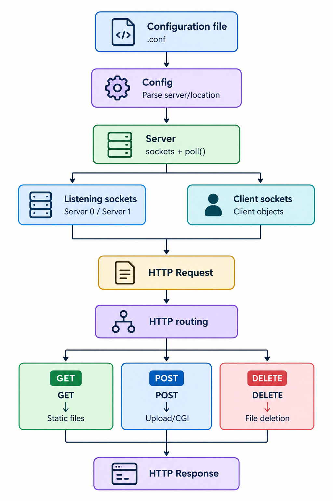
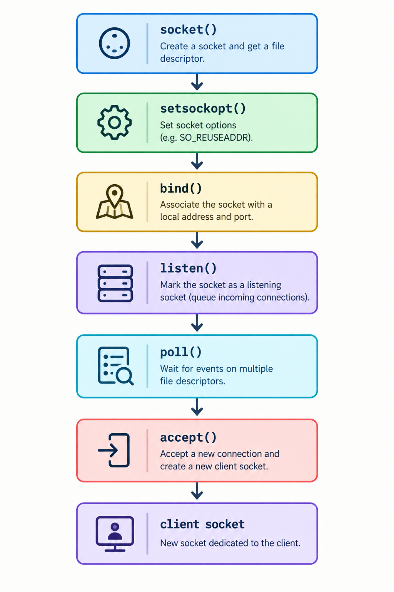
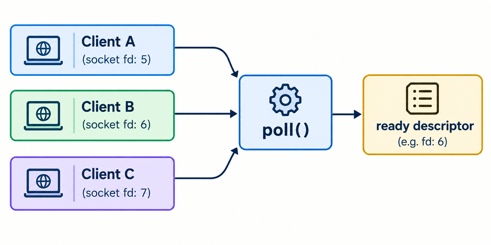
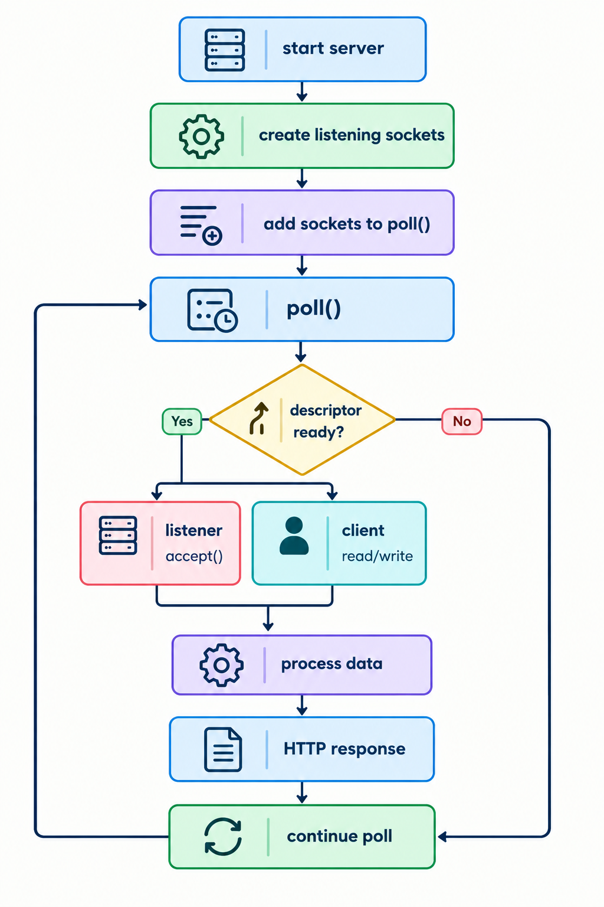
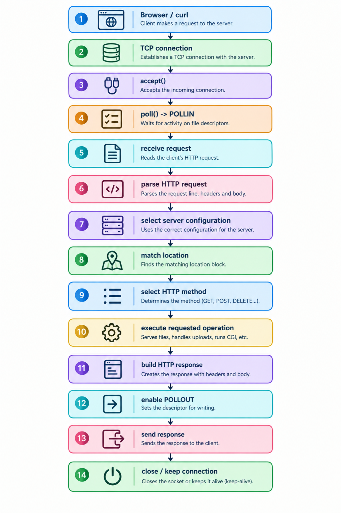
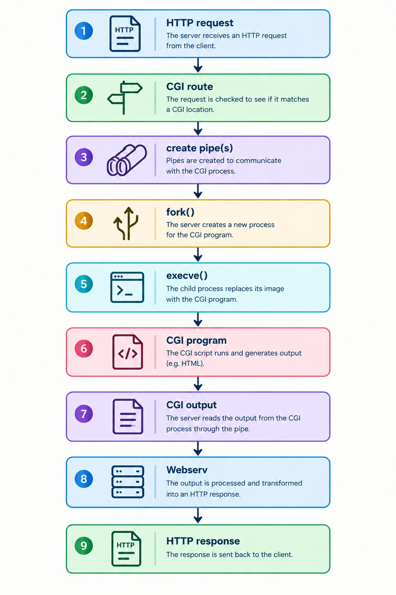

*This project has been created as part of the 42 curriculum by dgomez-l, pmendez- and owmarqui.*

# Descripcion

Webserv is an HTTP server written in C++98

The objetive of the proyect is implement a funcional HTTP server capable of:

*	Creating and managing TCP listenig sockects.
*	Accepting multiple clients simultaneously.
*	Multiplexing connections with poll()
*	Parsing sataitc files.
*	Routing request according to the server configuracion.
*	Serving static files.
*	Returning custom error pages.
*	Handling HTTP methods such as **"GET"**, **"POST"** and **"DELETE"**.
*	Receiving file uploads.
*	Executing CGI programs.
*	Managing Multiple servers listening on different ports.
*	Handling redirects.
*	Supporting directorty listeng /autoindex
*	Respecting configuration limits such as **"client_max_boys_size"**.

The server is designed around an event-driven architecture where socket activiy is monitored through **"poll()"** instead of creating a blocking process for every client.


# Description Structure

This project is composed by four types of files:

- **".cpp" files**.
	From now on referenced as **source files**.

- **".hpp" files**.
	From now on referenced as **header files**.

- **".o" files**.
	These files are only present during and after compilation.
	From now on referenced as **object files**.

- **"webserv" file**.
	This is the main and only executable file, present only after successful compilation.
	From now on referenced as **executable file** or **exec file**.


# Architecture


The main responsibility is divide between the server, client/request handling, configuraction and the different HTTP/CGI handleres


# TCP Sockets
The server uses TCP sockets to communicate with clients.
The general socket lifecycle is:



The listening socket is responsible for accepting new connections.

Once a client connects, accept() creates a new socket dedicated to that client.

The listening socket remains available to accept additional clients.

# Non-Blocking I/0

The sockets used by the server are configured for non-blocking operation.

This is important because a web server must be capable of managing multiple clients without getting blocked waiting for one particular client.

Instead of continuously blocking on one connection, the server asks the operating system which descriptors are ready for an operation.



This allows the server to manage several clients from the same event loop.

# Poll()
The main event loop uses poll() to monitro file descriptors.

The server maintains a collection of monitored descriptors.

The mian events are:
*	**POLLIN**
*	**POLLOUT**
*	**POLLHUP**
*	**POLLERR**
*	**POLLNVAL**

* **POLLIN**

The descriptor is ready for input.

For a listening socket this means that a new client can be accepted.

For a client socket this means that request data can be read.

* **POLLOUT**

The descriptor is ready for output.

This is used when a client has response data waiting to be sent.

* **POLLHUP**

The connection has been closed or hung up.

* **POLLERR**

An error condition has occurred.

* **POLLNVAL**

The descriptor is invalid.


# Main Event Loop
The server follows aproximately this logic:



This event loop is the central component of the server.

# Client Management

Each connected client contains information such as:

File descriptor.
Server associated with the connection.
Read buffer.
Write buffer.
HTTP request information.
Client state.
Last activity time.

The server_index is important when multiple servers are configured.

It allows the request to be processed using the configuration belonging to the server that accepted the connection.

For example:

        *127.0.0.1:8080*
                |
                v
            *Server 0*
                |
                +---- *client.server_index = 0*

        *127.0.0.1:8081*
                |
                v
            *Server 1*
                |
                +---- *client.server_index = 1*

This prevents a request received through one configured server from accidentally using another server's configuration.

# Multiple Servers

The configuration can define multiple servers.

For example:

  *Server 0 -> 127.0.0.1:8080*
  *Server 1 -> 127.0.0.1:8081*

Each server can have its own:

*	Port.
*	Host.
*	Root directory.
*	Index file.
*	Server name.
*	Error pages.
*	Locations.
*	CGI configuration.
*	Other configuration options.

When a client connects, the server remembers which listening socket accepted the connection.

The corresponding configuration is then selected when processing the request.

This allows multiple servers to behave differently while being managed by the same event loop.

# HTTP Request Flow

A normal request follows approximately this process:



# HTTP methods

The server handles the HTTP methods required by the project.

* **GET**

**GET** is used to retrieve resources.

Examples:

    curl http://127.0.0.1:8080/
    curl http://127.0.0.1:8080/index.html

Depending on the configuration, the request can return:

A static file.
An index file.
A directory listing.
A redirect.
An error page.
A CGI endpoint.

* **POST**

**POST** is used to send data to the server.

It can be used for:

Form submissions.
Uploading files.
Sending request bodies.
CGI requests.

Example:

    curl -X POST http://127.0.0.1:8080/upload \
        -F "file=@example.jpg"

The server reads the request body and processes it according to the configured route.

* **DELETE**

**DELETE** is used to remove resources when the requested location allows it.

Example:

    curl -X DELETE http://127.0.0.1:8080/uploads/example.jpg

The server verifies the requested resource and generates the corresponding HTTP response.

# Routing

The configuration can contain different location blocks.

A location associates a URL path with specific behaviour.

Conceptually:

        location / {
            root ...
        }

        location /upload {
            ...
        }

        location /cgi-bin {
            ...
        }

When a request arrives, the server determines which location matches the requested URI.

The selected configuration controls how the request is processed.

The routing process can be represented as:

            HTTP URI
                |
                v
        Find matching location
        |
        +---- /cgi-bin/... --> CGI
        |
        +---- /upload/... --> Upload handling
        |
        +---- /... -------> Static resource

# Static files

For a normal GET, the server builds the filesystem path from the configured root and requested URI.

For example:

        root = ./www
        URI  = /index.html

                |
                v

        ./www/index.html

The file is opened and its contents are used to construct the HTTP response.

The response includes the appropriate HTTP status and headers such as:

        HTTP/1.1 200 OK
        Content-Length: ...
        Content-Type: ...

# Error pages

The server supports configured error pages.

Typical HTTP errors include:

        400 Bad Request
        403 Forbidden
        404 Not Found
        405 Method Not Allowed
        413 Content Too Large
        415 Unsupported Media Type
        500 Internal Server Error

The exact errors available depend on the configuration and the request.

For example, requesting a resource that does not exist can result in:

HTTP/1.1 404 Not Found

with the configured error page returned as the response body.

# Redirects

Locations can be configured to redirect clients.

The server generates an HTTP redirect response containing the appropriate Location header.

Conceptually:

        Client
        |
        | GET /old
        v
        Webserv
        |
        | 3xx + Location: /new
        v
        Client
        |
        | GET /new
        v
        Webserv

# CGI

The server supports CGI execution.

CGI allows the HTTP server to execute an external program and use its output as part of the HTTP response.

The general flow is:



The project supports CGI interpreters such as:

        Python -> /usr/bin/python3
        Shell  -> /bin/bash

depending on the configured CGI extension.

# CGI Communication

The server communicates with the CGI process through pipes.

The CGI program receives the required environment/request information and generates output.

The server then reads the CGI output and transforms it into an HTTP response.

This makes CGI different from serving a static file:

        Static:

        GET -> open file -> read file -> HTTP response

        CGI:

        GET -> execute program -> read program output -> HTTP response


# Instructions

This section runs through what's needed to know before using/testing this project.

## Compilation

In order to compile this project, a Makefile is provided.

The available Makefile methods are as follows:

- Make all
	Target by default, will compile the entire project.
	This rule will also run when only executing *Make*.

- Make [.o file]
	Will compile the specified object file in the proper "objects" folder.

- Make clean
	Will clean all compilation files except the executable by deleting the "objects" folder.

- Make fclean
	Will return the project to a pre-compilation state, deleting the "objects" folder alongside the executable file.

- Make re
	Will execute *Make clean* and, immediately after, *Make all*, for a clean **re**-compilation of all files, while also re-instating all header files for all source files.

- Make leaks
	This is not a required target, and its intended use is for debugging and testing purposes.
	Will execute *Make all*, clear the console screen for best debugging experience, and run the command ***"valgrind --leak-check=full --show_leak_kinds=all ./webserv"***.
	This command launches the *valgrind* debugger, attaching it to the program born from the exec file, and, essentially, testing for leaks during the execution.
	In doing so, generates a convenient leaks report at the end of the program's execution.

This project's Makefile automates the compilation process by first compiling all source files into object files, and then compiles them into the final and ready executable file.

The reason behind this two-step compilation is to prevent relinking, since, due to how the Makefile is structured, it will check the date of the source files with their corresponding object files, and will only recompile those files that have suffered any changes since last compilation, so long as all object files are present.

Makefile can't compare with deleted files, and will always mark them as outdated if not present.

# Protocol for Project Correction

The following procedure can be used during a 42 evaluation.

- 1. Compile the Project
```bash
make re
```

The project must compile without warnings or errors.

Verify that the executable exists:

```bash
ls -l webserv
```

- 2. Start the Server
```bash
./webserv configs/default.conf
```

Verify that the configured listening socket is created successfully.

- 3. Test a Basic GET

From another terminal:

```bash
curl -i http://127.0.0.1:8080/
```

Verify:

Connection succeeds.
Correct HTTP status is returned.
Correct resource is served.
- 4. Test a Missing Resource
```bash
curl -i http://127.0.0.1:8080/not-found
```

Verify:

404 Not Found

and that the configured error page is returned when applicable.

- 5. Test HTTP Methods

Test:

```bash
curl -i -X GET http://127.0.0.1:8080/
curl -i -X POST http://127.0.0.1:8080/upload
curl -i -X DELETE http://127.0.0.1:8080/uploads/test.txt
```

Verify that each location respects its allowed methods.

- 6. Test File Upload

```bash
curl -i \
     -F "file=@test.txt" \
     http://127.0.0.1:8080/upload
```

Verify that the uploaded file appears in the expected directory.

- 7. Test Autoindex

```bash
curl -i http://127.0.0.1:8080/uploads/
```

Verify that the directory listing is generated when enabled.

- 8. Test CGI

```bash
curl -i http://127.0.0.1:8080/cgi-bin/test.py
```

Verify that the CGI program is executed and its output is returned correctly.

- 9. Test Redirects

Request a configured redirect location:

```bash
curl -i http://127.0.0.1:8080/redirect
```

Verify the status code and Location header.

- 10. Test Multiple Servers

Start:

```bash
./webserv configs/test_twoservers.conf
```

Then:
```bash
curl -i http://127.0.0.1:8080/
```

and:
```bash
curl -i http://127.0.0.1:8081/
```

Verify that both servers respond using their own configuration.

- 11. Test Simultaneous Clients

Run several requests simultaneously from different terminals:
```bash
curl http://127.0.0.1:8080/
curl http://127.0.0.1:8080/index.html
curl http://127.0.0.1:8080/cgi-bin/test.py
```

The server should continue processing available descriptors without blocking on a single client.

- 12. Test Invalid Requests

Send malformed or incomplete requests where possible and verify that the server does not crash.

The important property is:

Invalid request
      |
      v
HTTP error
      |
      v
Server continues running

- 13. Test Client Disconnects

Connect to the server and close the connection unexpectedly.

Verify that:

The client descriptor is removed.
No invalid descriptor remains in the poll list.
The server continues running.
No invalid memory access occurs.

- 14. Test Shutdown

Stop the server using the project's supported shutdown mechanism.

Verify that sockets and allocated resources are cleaned correctly.

After stopping the server, verify that the port can be reused by starting it again.

# Resources

- [GNU make (makefile) documentation](https://www.gnu.org/software/make/manual/)
	- [Relinking and how to avoid it](https://people.cs.pitt.edu/~znati/Courses/CogNet/related/makeintro.html)

- https://www.w3schools.com/cpp/cpp_templates.asp

- So far, as far as dgomez-l's apportations, AI was **not** used in the development of this project.

# Documentation

- Practical guide for HTTP + CGI + uploads:
	- [docs/GUIA_HTTP_CGI_UPLOADS_PMENDEZ.md](docs/GUIA_HTTP_CGI_UPLOADS_PMENDEZ.md)
	- [docs/GUIA_CGI_RUTAS_PMENDEZ.md](docs/GUIA_CGI_RUTAS_PMENDEZ.md)
